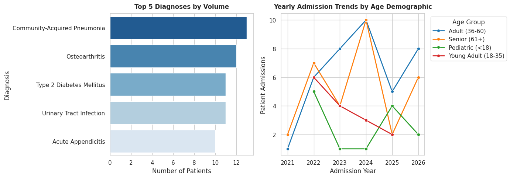

# Healthcare Analytics & Data Pipeline (Hex Workspace)

## Overview
This project provides an end-to-end data pipeline and analytical suite for a synthetic healthcare dataset (`synthetic_healthcare_dataset.csv`). Built for execution within a **Hex workspace**, it covers data cleaning, deduplication, schema standardization, and SQL/Python analytical queries targeting key stakeholder metrics.

---

## Workspace Structure & Setup

```text
├── synthetic_healthcare_dataset.csv  # Raw incoming dataset
├── clean_healthcare_dataset.csv      # Processed & cleaned export
├── healthcare_analytics.sql          # Data transformations & analytics queries
└── README.md                         # Documentation & stakeholder guide
```

---

## Data Cleaning Specification

The pipeline cleans raw input data by addressing duplicate records, missing values, date format anomalies, and categorical inconsistencies.

### Cleaning Rules
1. **Deduplication:** Removes exact duplicate rows (`patientid`, diagnosis, date, etc.).
2. **Missing Value Imputation:**
   * `age`: Missing values are imputed with the mean patient age ($\approx 46$) and rounded to nearest integer.
   * `gender`: Standardized and trimmed; empty or missing fields converted to `'Unknown'`.
   * `diagnosis` & `treatmenttype`: Trimmed; empty or missing fields converted to `'Unspecified'`.
3. **Date Validation:**
   * Converts `admission_date` into standardized `YYYY-MM-DD` format using safe type casting (`TRY_CAST`).
   * Drops records missing critical date information.
4. **Feature Engineering:**
   * `age_group`: Categorized into `Pediatric (<18)`, `Young Adult (18-35)`, `Adult (36-60)`, and `Senior (61+)`.
   * `admission_year`: Extracted integer year for trend reporting.

## Data Visualization




